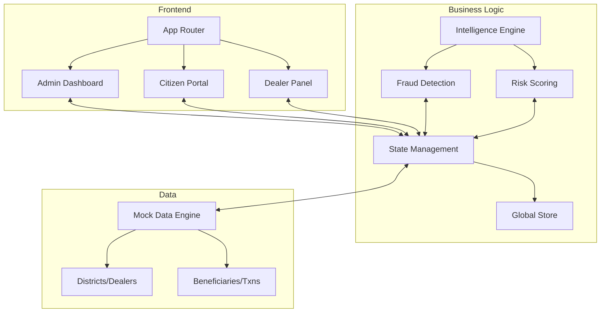

# 🇮🇳 RationTrack: Modernizing Public Distribution
### Government-Grade PDS Intelligence & Transparency Platform

[](https://nextjs.org/)
[](https://tailwindcss.com/)
[](https://lucide.dev/)

**RationTrack** is a high-fidelity, end-to-end modernization of the Public Distribution System (PDS). Built with a "customer-centric" design philosophy and powered by real-time anomaly detection, it bridges the gap between government administration, ration dealers, and citizens through a unified, premium digital experience.

---

## 🏛️ Project Vision
To transform the traditional PDS into a transparent, secure, and user-friendly ecosystem that ensures every citizen receives their rightful entitlements while providing administrators with the intelligence needed to eliminate fraud.

---

## ✨ Key Features

### 👨‍💼 Administrator Intelligence Dashboard
*   **SOC-Grade Monitoring**: Real-time fraud detection and anomaly scoring.
*   **Geospatial Insights**: Interactive district-level risk mapping and heatmaps.
*   **Automated Oversight**: Trust scores for dealers and automatic flagging of suspicious activities.
*   **Grievance Engine**: Unified workflow for resolving citizen complaints with status tracking.

### 🏪 Dealer Workspace
*   **High-Velocity Distribution**: Streamlined interface for logging ration collection in seconds.
*   **Smart Verification**: Automatic SMS-based handshake between dealer and citizen.
*   **Inventory Health**: Real-time stock tracking with automated replenishment requests.
*   **Live Audit Log**: Instant access to today's distribution history.

### 👤 Citizen Portal
*   **Identity & Quota**: Premium, glassmorphic profile showing entitlements and collection status.
*   **Interactive Search**: High-utility search for schemes, helpline, and shop locations.
*   **Secure Reporting**: Direct-to-admin grievance filing with real-time feedback.
*   **Entitlement Clarity**: Clear, icon-rich visualization of monthly rations.

---

## 🎨 Design System: "Saffron & Emerald"
The application utilizes a custom-built design system defined in `globals.css`:
*   **Aesthetic**: Glassmorphism with modern gradients (OKLCH color space).
*   **Typography**: Inter (Premium weight distribution).
*   **Interactive**: Micro-animations, hover lifts, and smooth state transitions.
*   **Accessibility**: High-contrast modes, large touch targets, and semantic HTML.

---

## 🛠️ Technology Stack
*   **Core**: Next.js 15 (App Router), React 19.
*   **Styling**: Tailwind CSS 4.0, OKLCH Variable Mapping.
*   **Icons**: Lucide React.
*   **State**: Custom Lightweight Store (Context + Reducer).
*   **Visuals**: Recharts (Data Viz), Leaflet (Geospatial).

---

## 🏗️ Architecture



---

## 🚀 Getting Started

1.  **Clone & Install**:
    ```bash
    git clone https://github.com/username/rationtrack.git
    cd rationtrack
    npm install
    ```

2.  **Run Development Server**:
    ```bash
    npm run dev
    ```

3.  **Access the Platform**:
    *   **Admin**: Select "Admin Dashboard" from the sidebar.
    *   **Citizen**: Select "Citizen Portal" from the sidebar.
    *   **Dealer**: Select "Dealer Panel" (Login: `DLR-001` / `pass123`).


---

<div align="center">
  <sub>Built with ❤️ for a more transparent India.</sub>
</div>
